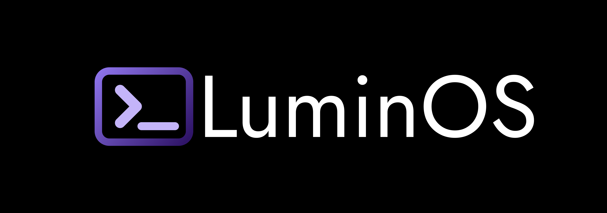
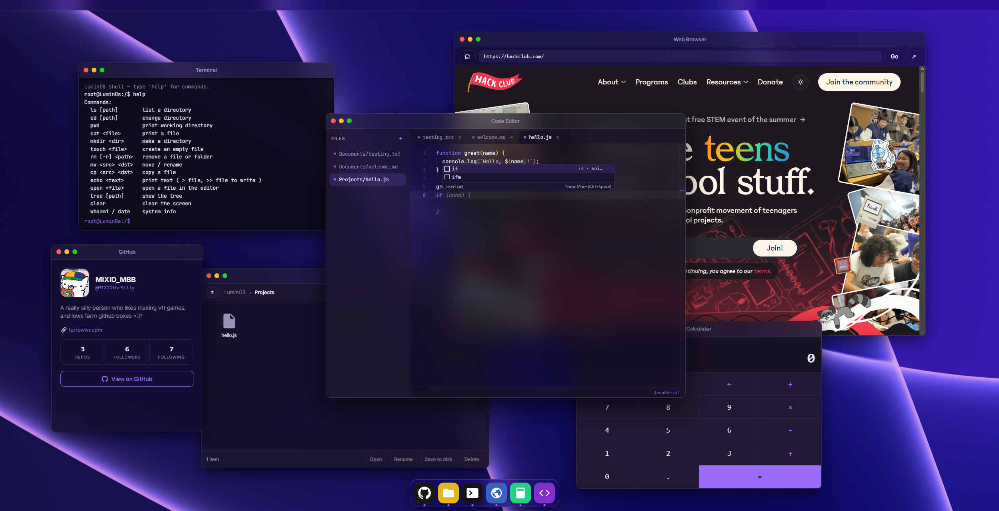

<p align="center">
  
</p>

# Lumin OS 

A web-based desktop OS that runs entirely in your browser. No installs, no backend, just open it and you get a desktop, a dock, draggable windows, and a set of apps that actually *work* together.

The goal isn't to make something that just *looks* like an OS for a screenshot. The goal is for it to actually be useful.

** -> [Try it here](https://lumin-os-theta.vercel.app) and star it while you like it :p**



## What's inside

Lumin OS is styled after macOS (menu bar up top with a live clock, a dock at the bottom, traffic-light window controls), but it's built from scratch in plain JavaScript.

- **Windows** you can drag, resize from any edge, minimize, maximize, and stack, a proper little window manager.
- **A dock** that launches apps and shows which ones are running.
- **A shared filesystem** that saves to your browser, so your files are still there next time you open it. Every app reads and writes the same files, so a change in one shows up everywhere instantly.

## Apps

| App | What it does |
| --- | --- |
| **Files** | A real file explorer: browse folders, breadcrumbs, new/rename/delete, import files from your computer or save them back out. |
| **Terminal** | An actual working shell. `ls`, `cd`, `cat`, `mkdir`, `rm`, `mv`, `cp`, `tree`, `echo > file`, command history, and more. Type `help`. |
| **Code Editor** | A VS Code-style editor built on **Monaco**, IntelliSense, Emmet, auto-closing tags, ~90 languages by file extension, tabs, and auto-save. |
| **Browser** | Browse the web in an iframe, with a graceful fallback (and "open in new tab" button) for sites that block embedding. |
| **Calculator** | A calculator. What else do you expect? |
| **GitHub** | A profile card for the project's creator (it's me). |

All three of Files, Terminal, and Editor share one filesystem — make a file in the terminal, edit it in the editor, manage it in Files, it's all the same thing.

## Running it

It's a fully static site, no build step and no dependencies to install. Just serve the folder:

```bash
# clone it
git clone https://github.com/MIXIDtheSilly/LuminOS.git
cd LuminOS

# serve it (any static server works), e.g.
python3 -m http.server 8000
